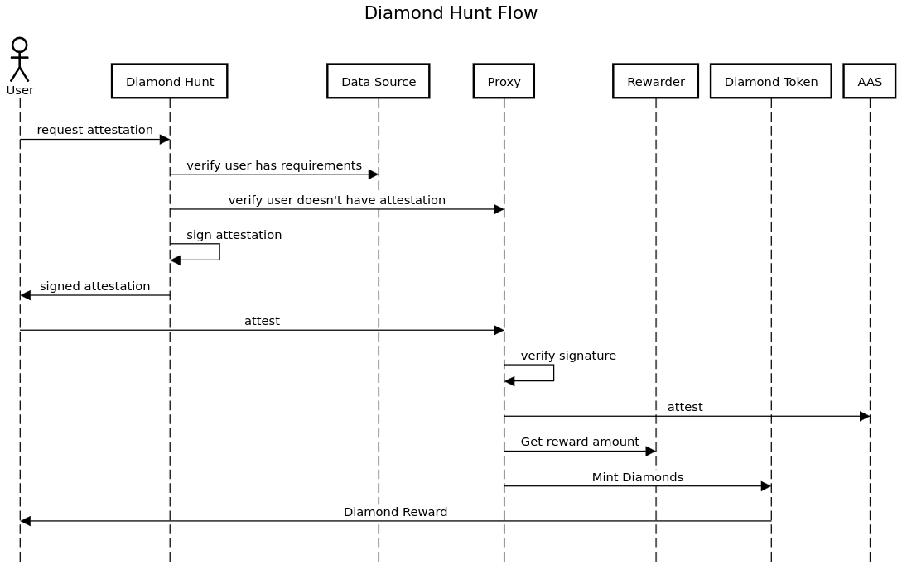

# Architecture

The user flow from perspective a user visiting a site and receiving an attestation.

## Components

A description of the main components of the diamond hunt app, familiarity with EAS service is assumed.

## Diamond Token

The Diamond token is a modified ERC20 with transfer functionality disabled. The
proxy is the sole account that can mint and burn tokens, it can burn tokens for
any holder without prior approval. A users diamond balance is a measure of
trusted they are based on attestations they have received.

## Proxy

The proxy contract is the sole address that attests as part of the diamond hunt
application. All attestations made by this address are valid diamond hunt
attestations. The proxy serves multiple purposes with the core 3 being:

1. Verifies signatures of attestations have been generated by a trusted address
2. Attests with AAS with enabled schemas
3. Mints/burns diamond tokens to recipients

The proxy has a state variable `attester`, all attestations sent to the proxy
must contain a valid signature from this account. This account can be updated
with the `updateAttester` function.

Schemas need to be enabled in the proxy (by the owner) before it will attest to
them. To do this the `addAttestationType` function needs to be called with the
following parameters:

* id (string which serves as the name)
* schema (bytes32 referencing an EAS schema ID)
* rewarder (address for a rewarder contract)

After the proxy attests it mints diamond tokens to the attestation recipient
according the a value returned by the rewarder.

## Rewarders

Rewarders are simple contracts with a single public function `rewardFor`. This
function receives encoded attestation data (decode with `abi.decode`) and
returns a _uint256_ amount which indicates how many diamonds to mint.

There are two included rewarders that return a constant amount and a variable
amount based on a value in the attestation.

## Web App

The web application is responsible for:

1. Verifying a user meets the criteria for receiving at attestation
2. Populating attestation data and signing attestation

The methods to verify criteria for an attestation is open ended and coded with
typescript. Some implemented methods involve:

* Reading a list of addresses from a CSV  (diamond hands)
* Querying an external API (joepegs, dex api)
* Performing authentication with an external service (twitter)
* Checking a signature is valid (referral system)
